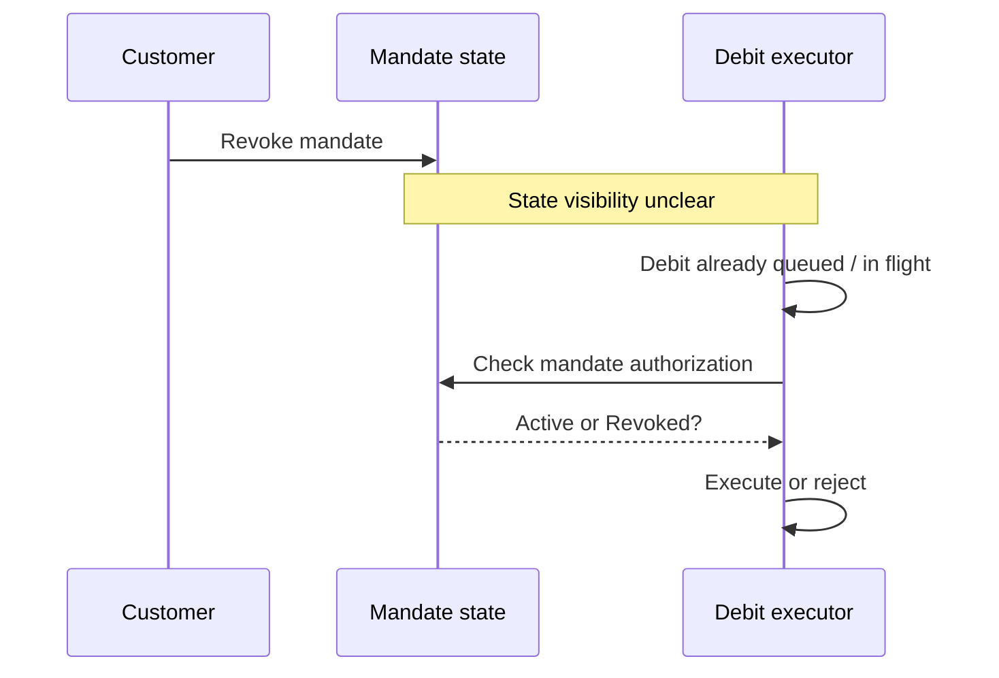
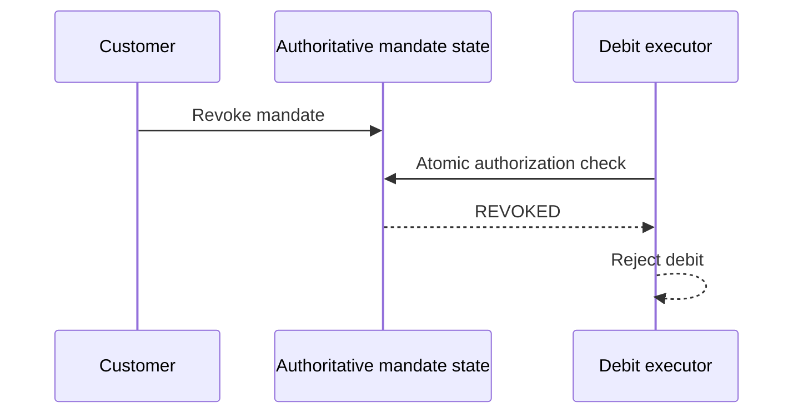

# Investigating Mandate-Revocation Semantics in Razorpay UPI Autopay

## Why I looked at this

I built [Capsule](https://github.com/Tanay-77/capsule), an AI purchasing agent that treats payment authorization as something that should be short-lived, scoped, and checked at the moment money is spent. Instead of giving an agent permanent access to a company card, Capsule reads the real checkout total, gets human passkey approval through Prava, and completes the purchase with a single-use, merchant-scoped payment credential.

That led me to a question about UPI Autopay: what happens when a customer revokes a mandate while a debit is already in the execution pipeline?

I have not found public evidence confirming that Razorpay has a production race condition here. I reached out to engineers at Razorpay for context, but haven't received a response yet - so I haven't treated this as a confirmed Razorpay issue. Instead, I approached it as a hypothesis that can be experimentally verified. This document therefore does **not** claim a Razorpay vulnerability. It identifies a consistency question that is not fully specified by the public API documentation and proposes a concrete test and mitigation.

---

## What Razorpay publicly documents

Razorpay's public UPI Autopay documentation describes a recurring-payment model built around a registered mandate represented by a `token_id`.

The documented flow is:

1. A customer authorises a UPI Autopay mandate.
2. Razorpay returns a `token_id` representing the registered mandate.
3. Subsequent debits use that `token_id` together with a new order.
4. Razorpay provides APIs to fetch, cancel, or delete the token/mandate.
5. Razorpay recommends webhooks for tracking mandate and payment status changes.

Source: [Razorpay - UPI Autopay](https://razorpay.com/docs/payments/payment-gateway/s2s-integration/recurring-payments/upi/?preferred-country=IN)

Razorpay's TPAP Pro documentation separately exposes mandate operations including create, update/revoke, pause/resume, approve, reject, and fetch.

Source: [Razorpay - Mandate APIs](https://razorpay.com/docs/api/payments/tpap-pro/mandate-flow/?preferred-country=IN)

The revoke operation is explicitly represented as a separate API action:

```text
PATCH /v1/upi/tpap/mandates/:umn
action = revoke
```

Razorpay's documentation also states that a mandate can reach the terminal `completed` state when it has been revoked by the payer or payee.

Source: [Razorpay - Update or Revoke a Mandate](https://razorpay.com/docs/api/payments/tpap-pro/mandate-flow/update-revoke-mandate/)

---

## What the public documentation does NOT establish

The public API documentation tells us that mandates can be revoked and that subsequent payments use the registered mandate.

What it does not specify is the exact concurrency/ordering guarantee between:

- a mandate revocation,
- a debit that has already been created or queued,
- the point at which the debit becomes irreversible,
- and the authorization state checked by the debit executor.

In particular, the public documentation does not establish whether an already-queued debit can execute after a revocation becomes effective, nor does it document an atomic transaction boundary between revocation and debit execution.

That distinction matters.

**This is the research question - not a claim that the race already exists.**

---

## The hypothesis

The hypothesis is:

> If a recurring debit has already entered an execution path when a customer revokes the mandate, there may be a race between the debit's authorization decision and the revocation becoming authoritative.

A possible sequence would look like this:



The open question in that diagram: when does the debit executor actually see the revoked state - before, during, or after it checks authorization? The important unknown is the ordering between the final authorization check and the revocation.

---

## Why this is a meaningful systems question

This is fundamentally a **distributed-systems consistency problem**.

The dangerous state is not simply:

```text
Mandate = ACTIVE
```

or:

```text
Mandate = REVOKED
```

The interesting state is:

```text
Revocation has happened
+
A debit is already somewhere in the execution pipeline
+
The system must decide which state is authoritative
```

A robust payment system needs a clear rule for this boundary.

The public documentation does not tell us enough to determine that rule for every concurrent case.

---

## A better model for the problem

I would model the execution path as:

```text
                ┌──────────────────────┐
                │   UPI Autopay        │
                │   Mandate            │
                └──────────┬───────────┘
                           │
                           ▼
                ┌──────────────────────┐
                │ Authorization state  │
                │ ACTIVE / REVOKED     │
                └──────────┬───────────┘
                           │
                           ▼
                ┌──────────────────────┐
                │ Debit request        │
                │ queued / executing   │
                └──────────┬───────────┘
                           │
                           ▼
                ┌──────────────────────┐
                │ Final authorization  │
                │ decision             │
                └──────────┬───────────┘
                           │
                    ┌──────┴──────┐
                    ▼             ▼
                 Execute        Reject
```

The design question is whether the final authorization decision is guaranteed to observe the authoritative mandate state.

---

# The proposed mitigation

I would **not** propose replacing UPI Autopay mandates with single-use UPI tokens.

That was the original Capsule analogy, but UPI Autopay itself is designed around a recurring mandate. Replacing that mechanism would require assumptions about the underlying UPI architecture that the public documentation does not support.

Instead, the stronger proposal is:

## Atomic execution-time authorization

Keep the existing UPI mandate, but make the debit executor perform an authoritative authorization check as close as possible to the point where the debit becomes irreversible.

Conceptually:



The key property is not the existence of a new token.

The key property is:

> **A debit should not rely on a stale authorization decision when the mandate has already been revoked.**

If the system is distributed, this may require a strongly consistent state transition, an atomic compare-and-check operation, or another mechanism that defines the exact ordering between revocation and execution.

---

# The experiment that would actually prove the hypothesis

I would test the behavior rather than infer it from API structure.

## Test setup

Use a legitimate Razorpay sandbox/test environment with:

- a test UPI Autopay mandate,
- a recurring debit configuration,
- a controlled debit request,
- logging around every request and response,
- timestamps with sufficient precision to reconstruct ordering.

The goal is to test **ordering**, not to force an unauthorized real-world charge.

Five orderings cover the space worth testing:

| Test | Sequence | Question |
|---|---|---|
| **A - Revoke before debit** | Revoke → confirmed → submit debit | Baseline: is the debit rejected once revocation is confirmed? |
| **B - Debit queued before revoke** | Submit debit → queued/executing → revoke | Does the already-queued debit still execute, or does the executor re-check the authoritative state? |
| **C - Concurrent** | Revoke and debit fired at the same time | Is there a *defined, consistent* ordering rule - not necessarily "revoke always wins," but a rule at all? |
| **D - Revoke acknowledged, then debit** | Revoke → response confirms completion → debit request | Can a debit still execute after revocation is acknowledged as complete? |
| **E - Debit submitted, then revoke** | Debit submitted → revoke → debit reaches final processing | At what point does revocation stop being able to halt the transaction? This matters because "revoke the mandate" and "cancel an already-submitted payment" may not be the same operation underneath. |

Test A is the baseline sanity check. B through E are where the actual research value is - they isolate exactly when, in the pipeline, revocation stops being effective.

---

# What would constitute evidence of a gap?

I would consider the hypothesis supported only if controlled testing demonstrates a behavior such as:

```text
1. Customer revokes mandate.
2. Revocation is acknowledged/authoritative.
3. A debit associated with that mandate still executes.
4. The debit executor did not perform an authoritative post-revocation check.
5. The behavior is reproducible under controlled concurrency.
```

A single surprising result would not be enough. It would need to be reproduced and the exact state transition understood.

---

# What would falsify the hypothesis?

The hypothesis would be weakened or rejected if testing demonstrates that:

```text
Revoke becomes authoritative
        ↓
Debit execution checks the authoritative mandate state
        ↓
Debit is rejected
```

including when the revoke and debit operations are concurrent.

If Razorpay already guarantees this behavior internally, then the proposed mitigation is unnecessary for that part of the system.

That would still be a useful result: the research question would have been answered.

---

# Why the Capsule connection still matters

Capsule and UPI Autopay solve different authorization problems.

Capsule asks:

> "Can an AI agent spend money right now?"

UPI Autopay asks:

> "Can this recurring mandate be used for this scheduled debit?"

The shared principle is:

> **Authorization should be evaluated against the correct current state at the moment an irreversible action is taken.**

Capsule uses scoped, single-use credentials because that fits its problem.

UPI Autopay may instead need a strongly consistent execution-time check against the mandate state.

The important idea is therefore not "use Capsule's token system inside Razorpay."

It is:

> **carry the same authorization principle into a different payment architecture.**

---

# Trade-offs and engineering considerations

## 1. Latency

A strongly consistent authorization check on every debit can add latency to the payment hot path.

At large scale, the lookup must be extremely fast and horizontally scalable.

The goal should be to improve correctness without introducing a new central bottleneck.

## 2. Concurrency

The system needs a precise rule for concurrent operations.

For example:

```text
revoke wins
```

or:

```text
debit wins if execution crossed a defined commit point
```

Either can potentially be valid depending on the payment-network semantics.

What matters is that the boundary is explicit and consistent.

## 3. Retries

Payment systems retry requests because of:

- network failures,
- timeouts,
- temporary processor failures,
- webhook delays.

A new authorization gate must work correctly with idempotency and retries.

A legitimate retry should not accidentally look like a second authorization.

## 4. In-flight transactions

Revoking a mandate should not necessarily be assumed to cancel a payment that has already crossed an irreversible processing boundary.

The system needs to distinguish:

```text
scheduled
queued
submitted
processing
successful
```

from:

```text
mandate authorization state
```

These are different state machines.

## 5. Migration

If a new execution-time authorization mechanism were introduced, existing mandates would need a migration strategy.

This should not be treated as a simple feature flag.

---

# An important current Razorpay development

Razorpay is also implementing UPI Autopay interoperability based on NPCI Circular OC-163 and OC-163A, with rollout beginning in July 2026.

Razorpay's documentation says this changes the relationship between mandates, payment processors, and UPI apps. It also describes Razorpay maintaining mandate records and updating mandate information during migration and payer-porting flows.

Source: [Razorpay - UPI Autopay Interoperability](https://razorpay.com/docs/payments/recurring-payments/autopay-interoperability/?preferred-country=IN)

This makes the consistency question even more interesting from a systems perspective: as mandates become interoperable across processors and UPI apps, the system has more state transitions and more actors that can affect mandate state.

However, **this interoperability work does not itself prove a revocation race**. It is simply additional context that makes explicit state-management guarantees important.

---

# What I currently believe

Based on the public documentation, I am confident about these points:

- Razorpay supports UPI Autopay recurring mandates.
- A registered `token_id` represents the mandate used for future debits.
- Razorpay exposes mandate/token management operations including cancellation/revocation.
- Razorpay documents mandate status transitions, including a terminal `completed` state after revocation.
- The public documentation does not specify enough detail to determine the exact atomicity/ordering guarantees between mandate revocation and a concurrent or already-queued debit.

I am **not** currently confident enough to claim:

- Razorpay has a production mandate-revocation vulnerability.
- Razorpay uses a webhook/RTR delay as the mechanism behind such a vulnerability.
- An already-queued debit definitely succeeds after revocation.
- RazorpayX specifically has this behavior.
- The proposed single-use-token architecture is directly compatible with UPI Autopay.

Those claims require either internal confirmation or controlled testing.

---

# Conclusion

The interesting problem here is not:

> "I found a bug in Razorpay."

It is:

> **"The public API tells us how to revoke a mandate, but not enough about the concurrency boundary between revocation and debit execution. Can that boundary be experimentally characterized, and can the execution path be designed so that an authoritative revocation cannot be bypassed by stale authorization state?"**

That is the question I would take to a Razorpay engineer.

If the current system already provides an atomic execution-time check, great - the hypothesis is disproved.

If it does not, the next engineering question is whether that guarantee can be introduced without compromising UPI semantics, latency, throughput, retries, or idempotency.

That is a much more interesting problem than simply adding another cancellation API.

---

# Sources

1. [Razorpay - UPI Autopay](https://razorpay.com/docs/payments/payment-gateway/s2s-integration/recurring-payments/upi/?preferred-country=IN)
   - Documents UPI Autopay, `token_id`, subsequent debits, token/mandate management, and webhooks.

2. [Razorpay - Mandate APIs](https://razorpay.com/docs/api/payments/tpap-pro/mandate-flow/?preferred-country=IN)
   - Documents create, update/revoke, pause/resume, approve, reject, and fetch mandate operations.

3. [Razorpay - Update or Revoke a Mandate](https://razorpay.com/docs/api/payments/tpap-pro/mandate-flow/update-revoke-mandate/)
   - Documents the `PATCH` revoke operation and mandate status semantics.

4. [Razorpay - Fetch Mandates](https://razorpay.com/docs/api/payments/tpap-pro/mandate-flow/fetch-mandates/?preferred-country=IN)
   - Documents fetching a mandate by UMN and the mandate status values.

5. [Razorpay - UPI Autopay Interoperability](https://razorpay.com/docs/payments/recurring-payments/autopay-interoperability/?preferred-country=IN)
   - Documents the 2026 interoperability changes and migration/porting model.

---

## Confidence statement

This document is a technical research hypothesis and design proposal, **not a confirmed security finding or claim about Razorpay's internal implementation**.

The exact behavior of concurrent mandate revocation and debit execution must be verified through controlled testing or confirmation from the relevant payment infrastructure team.
