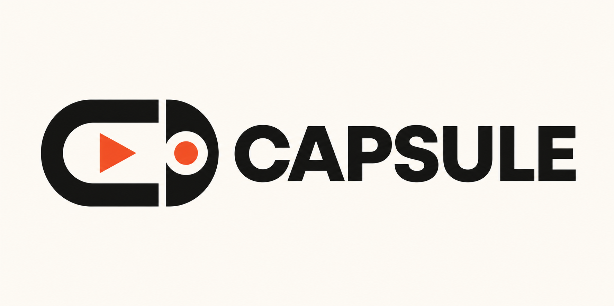

# Capsule



Capsule is an AI purchasing agent that provisions software without giving the agent permanent access to a company card.

A user can type:

> Provision one Linear Basic seat for a 10-day QA sprint.

Capsule explains that Linear has a monthly billing minimum, reads the real checkout total, creates a Razorpay Order for the exact amount, asks the user to approve through a passkey, and completes the purchase through a Razorpay Payment Link.

## What it demonstrates

- Natural language to a validated purchase intent
- Honest handling of merchant billing constraints
- Real amount and currency read from Linear checkout
- Exact-amount Razorpay Order (no overpayment possible)
- Human passkey approval (Capsule acts as its own WebAuthn relying party; it registers a passkey on first use and authenticates on subsequent uses)
- Payment Link with tight expiry (no stale payments)
- Webhook confirmation with amount recheck before marking complete
- Live agent logs through Server-Sent Events (SSE)
- A renewal demo where no approval creates no new payment

## Flow

```text
User request
  -> Parse intent
  -> Resolve against Capsule's catalog
  -> Create Razorpay Order (exact amount in paise)
  -> Passkey approval (Capsule's own WebAuthn gate)
  -> Create Payment Link (tight expiry)
  -> User completes test-mode checkout on Razorpay
  -> Webhook confirms + amount rechecked
  -> Audit trail via SSE
  -> Renewal prompt at period end (fresh Order/Link required, nothing auto-renews)
```

Capsule never stores reusable payment credentials. The Razorpay key secret stays on the Express server.

## Billing behavior

Linear does not sell a 10-day subscription. Capsule keeps the original 10-day sprint request but explains that the purchase requires one monthly billing cycle.

The parser's amount is only a preview. The amount read from Linear's real checkout page is what Capsule sends to Razorpay as the Order amount.

## Stack

- Next.js 14, TypeScript, and Tailwind CSS
- Express and TypeScript
- OpenAI Responses API and Zod
- Playwright with a persistent Linear login
- Razorpay Orders API + Payment Links API + Webhooks
- Server-Sent Events

## Project structure

```text
web/                   Next.js frontend
server/src/agent/      Intent parser and provisioning flow
server/src/razorpay/   Razorpay REST client, types, and webhook verification
server/src/events/     Typed event emitter
server/src/routes/     Express routes (agent, razorpay webhook)
server/agent/          Tests and standalone runners
```

## Setup

Requirements: Node.js 20+, npm, Chrome, OpenAI and Razorpay test-mode keys, and a disposable Linear workspace.

Install dependencies:

```powershell
npm install
```

Create the server environment file:

```powershell
Copy-Item .env.example server/.env
```

Add your keys to `server/.env`:

```env
RAZORPAY_KEY_ID=rzp_test_YOUR_KEY_ID
RAZORPAY_KEY_SECRET=YOUR_KEY_SECRET
RAZORPAY_WEBHOOK_SECRET=YOUR_WEBHOOK_SECRET
OPENAI_API_KEY=YOUR_OPENAI_API_KEY
ENABLE_MOCK_AGENT=true
```

Never expose `RAZORPAY_KEY_SECRET` in the frontend or commit `.env` files.

Start Capsule:

```powershell
npm run dev
```

Open `http://localhost:3000`. Express runs on port `3001`.

## Razorpay webhook setup

1. Expose port `3001` with a tunnel (e.g., ngrok, Cloudflare Tunnel)
2. In the Razorpay Dashboard, create a webhook:
   - **Webhook URL**: `https://YOUR_PUBLIC_DOMAIN/api/razorpay/webhook`
   - **Secret**: Copy to `RAZORPAY_WEBHOOK_SECRET` in `server/.env`
   - **Active Events**: `payment_link.paid`, `order.paid`
3. Restart the backend after updating `.env`

## Modes

| Mode | Behavior |
|---|---|
| Mock | Simulates the full event flow without Playwright or Razorpay calls. |
| Dry | Reads the real Linear total and creates a Razorpay Order, but does not create a Payment Link. |
| Real | Runs the complete test-mode Order → Payment Link → Webhook flow. |

Set `ENABLE_MOCK_AGENT=false` and restart the backend before using Dry or Real mode.

## First Linear login

Capsule saves a separate Playwright browser profile so it does not automate login, MFA, or SSO.

```powershell
npm run linear:login
```

Log in manually, confirm Linear is open, and close the browser. Later runs reuse the saved session.

## Useful commands

```powershell
npm run typecheck        # Check TypeScript
npm run build            # Production build
npm run agent:unit       # Unit tests without OpenAI spend
npm run linear:login     # Save Linear login
npm run linear:dry-run   # Quote without purchase
npm run linear:real      # Real sandbox checkout
```

## Renewal demo

After a completed Mock or Real purchase, Capsule compresses one monthly billing cycle into a short timer and asks:

> Approve the next monthly cycle?

Approval starts a fresh quote, Razorpay Order, passkey, and Payment Link flow. Silence creates no new Order, no Payment Link, and no charge attempt.

For a short demo, use 8 seconds for the billing-cycle timer and 8 seconds for the silence window.

## Security

- Payment happens entirely on Razorpay's hosted Payment Link page.
- Razorpay webhook signatures are verified (HMAC SHA256 + `timingSafeEqual`).
- Webhook handler rechecks `amount_paid === order.amount` before confirming.
- No reusable payment credentials are stored by Capsule.
- Secrets remain on the Express server.

## Current limitations

- Linear automation can require updates when its UI changes.
- Runs, SSE history, demo timers, and the registered WebAuthn passkey are stored in memory. A server restart wipes the passkey, meaning the next approval will behave as a first-time registration rather than an authentication. This is an intentional demo simplification; production would persist per-user credentials to a database.
- Automatic "cancel at end of billing period" is not implemented yet.
- Production would require authentication, a database, durable jobs, and audit logs.

## Hackathon demo

Run Mock mode live for reliability, show the recorded successful Real checkout, and finish with the unanswered renewal screen: **NO APPROVAL / NO CHARGE**.